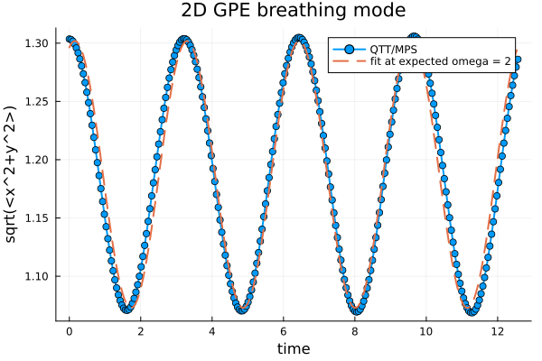
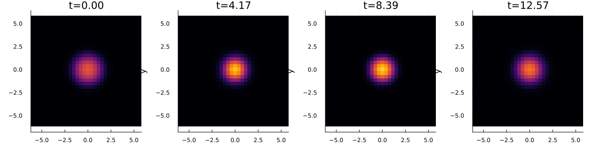

# 2D GPE breathing mode with a space-time QTT solver

Source code and recorded results for a two-dimensional Gross–Pitaevskii
interaction quench, solved with a quantics tensor train / matrix product state
(QTT/MPS) space-time all-at-once method.

The initial state is a ground state at **g₁ = 12.5**. Real-time evolution uses
**g₂ = 6.25** in an isotropic harmonic trap. The repository contains the 07
driver, its required shared core, the six original breathing output files,
and the associated g=12.5 ground-state input and diagnostics. Other benchmark
drivers and upstream package source trees are not included.



## Recorded result and validation status

**The supplied run has `validation_pass = false`.** Picard convergence and
the inner residual meet their configured tolerances, but the norm drift
exceeds the required `1e-4`. The original data and validation thresholds are
preserved.

| Quantity | Recorded value |
| --- | ---: |
| Spatial grid | 32 × 32 |
| Time steps | 256 |
| Final time | 4π ≈ 12.56637 |
| Time step | 0.0490873852 |
| Picard iterations | 25 |
| Final Picard relative change | 6.4128064 × 10⁻⁶ |
| Inner global residual | 4.6256332 × 10⁻⁶ |
| Maximum solution bond dimension | 77 |
| Maximum density bond dimension | 158 |
| Maximum inner-sweep discarded weight | 3.9523940 × 10⁻¹⁴ |
| Norm drift | 3.1760997 × 10⁻⁴ |
| Relative energy drift | 1.8955385 × 10⁻⁵ |
| Expected breathing angular frequency | 2 |
| Dominant DFT-bin angular frequency | 1.9922179 |
| Relative difference from 2 | 0.3891% |

The reported frequency is the maximum-amplitude **discrete Fourier bin**, not
a continuous-frequency fit. There are 257 samples including t=0; the bin spacing
is approximately 0.498054 in angular-frequency units. The 0.3891%
difference should therefore not be interpreted as a frequency uncertainty or
a demonstrated sub-percent frequency accuracy. The dashed curve in the width
plot fits an offset and sine/cosine amplitudes at the fixed theoretical frequency
ω=2; it does not fit ω itself.

## Model and numerical conventions

In oscillator units, the real-time equation is

$$i\partial_t\psi = \left[-\frac12\nabla^2 + \frac12(x^2+y^2) + g_2|\psi|^2\right]\psi.$$

- Periodic spatial grid; its size and halfwidth come from the ground-state metadata.
- Crank–Nicolson time discretization with Picard iteration for the nonlinear term.
- QTT bit ordering: `[time][x][y]`.
- Internally, `psi_tilde = sqrt(ΔV) * psi`, so the discrete coupling is `g/ΔV`.
- The recorded run has `g_discrete = 44.44444444` after the quench.
- The density used in each Picard Hamiltonian is normalized per time slice;
  the resulting real-time wavefunction is not artificially renormalized.

## Files

| Path | Purpose |
| --- | --- |
| `07_GPE_realtime_2D_breathing_poster.jl` | Driver and numerical parameters |
| `SpaceTimeQTT_AllAtOnce_Core.jl` | Shared operators, solver helpers, diagnostics and output |
| `Project.toml` | Julia dependencies and fixed upstream revisions |
| `setup.jl` | Installs the upstream packages at the specified revisions |
| `inputs/` | Initial ground state and its original diagnostics |
| `validation_outputs/POSTER_07_GPE_realtime_2D_breathing_4period/` | Original, unchanged results |
| `DEPENDENCIES.md` | Upstream attribution and snapshot provenance |

The shared core retains its existing helper and runner functions to avoid
changing numerical dependencies; only the 07 driver is distributed here.

## Dependencies

Use **Julia 1.12.2** for consistency with the supplied upstream manifests;
the installation script requires Julia 1.12 or newer.

| Module | Upstream project | Fixed commit | Role |
| --- | --- | --- | --- |
| `MPSCore` | [chiamin/JuliaMPS](https://github.com/chiamin/JuliaMPS) | `8bdfeb4db57d568e0ff3b7b3730d4a5b66b55f80` | MPS/MPO representation and tensor operations |
| `QTTCore` | [chiamin/JuliaQTT](https://github.com/chiamin/JuliaQTT) | `3b3dc804c5051a88e2dc61b0fc29ed87abf586af` | QTT grids, operators and solver interfaces |

This project is intended for the upstream author and collaborators with access
to these dependencies. The repositories may be private: installation requires
an authorized GitHub account with access to the exact revisions above. 

## Install

From this repository's root:

```bash
julia setup.jl
```

Setup creates a local `Manifest.toml`. The two upstream source revisions are
fixed, but all registry dependencies have not been frozen to the original run's
environment. Keep the generated Manifest after a successful installation and
verification. A clean installation has not been verified with authorized upstream access.

## Run

The initial state is included at **`inputs/ground_state_state.jls`**. After
installing the dependencies with an authorized account, run:

```bash
julia --project=. 07_GPE_realtime_2D_breathing_poster.jl
```

The input comes from `POSTER_04_GPE_imaginary_2D_g12p5`: a g=12.5 ground state
on a 32 × 32 periodic grid with halfwidths [6,6]. Its original summary reports
`validation_pass = true` and stationary residual 3.7909559 × 10⁻⁵. Its CSV norm,
RMS radius, boundary-density summary and quench-adjusted energy agree with the
recorded 07 output at t=0. This ground-state validation is separate from the
real-time run's failed norm-drift criterion described above.

The ground-state CSV, image, summary and Picard history are also in `inputs/`.
Viewing the archived figures and CSV files needs no Julia installation.

To use a different saved state, pass its path explicitly:

```bash
julia --project=. 07_GPE_realtime_2D_breathing_poster.jl "/path/to/ground_state_state.jls"
```

With no argument, the driver first checks `inputs/ground_state_state.jls`, then
the legacy `POSTER_04_GPE_imaginary_2D_g12p5` and `ST_04_GPE_imaginary_2D_g12p5`
directories under `validation_outputs`, in that order.

New runs write to `validation_outputs/RUN_07_GPE_realtime_2D_breathing_4period/`
by default, preserving the archived results. An optional environment variable
`QTT_OUTPUT_NAME` changes this subdirectory name. The driver retains the supplied
parameters and tolerances; `make_movie=false`.

## Output data

`breathing_observables.csv` has 257 rows (t=0 plus 256 time steps):

| Column | Meaning |
| --- | --- |
| `time` | Dimensionless time |
| `norm2` | Sum of squared magnitudes of the scaled state |
| `rms_radius` | Normalized √⟨x²+y²⟩ |
| `gpe_energy_g2` | Energy at g₂, evaluated after normalizing the state |
| `boundary_density` | Maximum boundary density of the normalized state |
| `fit_at_expected_omega_2omega` | Radius fit at the fixed theoretical breathing frequency |

`picard_history.csv` records the nonlinear relative change, inner residual,
sweeps, bond dimensions and truncation measure per Picard iteration.
`summary.txt` contains run settings, diagnostics and the original validation flag.



The density image contains four selected time slices. The full space-time
wavefunction is not present in this dataset, so arbitrary new density slices
or animations require the state data or a new simulation.

## Packaging changes and checks

- Removed the development-environment note from source comments.
- Replaced machine-specific dependency discovery with this repository's Julia project.
- Added an explicit ground-state argument and separate rerun output directory.
- Kept all numerical solver bodies, driver numerical parameters and output bytes unchanged.
- Checked the original CSV values against the recorded norm drift, energy drift
  and DFT frequency, verified ground-state consistency with t=0, and checked
  file checksums. The serialized state was not deserialized during these checks.

This is a package of an existing run, not a new numerical validation. The Julia
installation and simulation have not been rerun for this release.
